# Wine Quality MLOps Platform

Production-ready machine learning platform for wine quality prediction with comprehensive MLOps infrastructure, automated pipelines, and cloud deployment capabilities.

---

## Table of Contents

1. [Project Overview](#project-overview)
2. [Architecture](#architecture)
3. [Technology Stack](#technology-stack)
4. [Machine Learning Pipeline](#machine-learning-pipeline)
5. [MLflow Experiment Tracking](#mlflow-experiment-tracking)
6. [Apache Airflow Orchestration](#apache-airflow-orchestration)
7. [REST API Services](#rest-api-services)
8. [Monitoring Dashboard](#monitoring-dashboard)
9. [CI/CD Pipeline](#cicd-pipeline)
10. [Cloud Deployment](#cloud-deployment)
11. [Security](#security)
12. [Getting Started](#getting-started)
13. [Additional Documentation](#additional-documentation)

---

## Project Overview

This project implements a complete MLOps lifecycle for wine quality prediction. The platform demonstrates how machine learning models transition from experimental notebooks to production-ready services with proper versioning, monitoring, and automated deployment.

### The Business Problem

Wine quality assessment traditionally relies on expert sommeliers who evaluate wines based on sensory analysis. This process is subjective, time-consuming, and difficult to scale. Machine learning offers an objective, consistent approach by learning patterns from physicochemical properties that correlate with quality ratings.

The challenge lies in the subjective nature of quality ratings and the complex, non-linear relationships between chemical properties and perceived quality. For instance, higher alcohol content generally correlates with better ratings, but only up to a point. Similarly, volatile acidity (which creates vinegar-like tastes) negatively impacts quality, but trace amounts contribute to complexity.

### The MLOps Solution

Rather than simply training a model and deploying it once, this platform implements continuous machine learning operations. When new data arrives, the system automatically retrains models, compares their performance against production baselines, and promotes superior versions through a staged deployment process. This ensures the prediction service always uses the best available model while maintaining full traceability of every experiment.

The platform addresses the full ML lifecycle: data versioning ensures reproducibility, experiment tracking enables systematic model comparison, automated pipelines eliminate manual intervention, monitoring detects performance degradation, and CI/CD practices ensure reliable deployments.

### Dataset Characteristics

The UCI Wine Quality dataset contains 1,599 samples of Portuguese red wine. Each sample includes eleven physicochemical measurements: fixed acidity, volatile acidity, citric acid, residual sugar, chlorides, free sulfur dioxide, total sulfur dioxide, density, pH, sulphates, and alcohol content. Expert panels rated each wine on a quality scale from 0 to 10, with most wines clustering around scores of 5 and 6.

The dataset presents several modeling challenges. Quality ratings are subjective and experts often disagree. The feature space contains complex interactions where the same chemical property can have positive or negative effects depending on other factors. Class imbalance means the model sees few examples of very high or very low quality wines.

---

## Architecture

The platform follows a microservices architecture where each component handles a specific responsibility. This separation allows independent scaling, easier debugging, and the flexibility to upgrade individual services without disrupting the entire system.

### System Design Philosophy

The architecture prioritizes reproducibility and observability. Every model training run captures its exact configuration, data version, and results. Every prediction request logs its inputs and outputs. This comprehensive tracking enables debugging production issues by replaying exact conditions and supports regulatory compliance in industries requiring model explainability.

The design also emphasizes automation. Manual processes introduce errors and delays. By automating everything from code quality checks to model deployment, the platform ensures consistent, reliable operations regardless of team size or expertise level.

### Service Topology

```
+------------------------------------------------------------------+
|                   Wine Quality MLOps Platform                     |
+------------------------------------------------------------------+
|                                                                   |
|  +-------------+  +-------------+  +-------------+  +----------+  |
|  |  Airflow    |  |  MLflow     |  | Streamlit   |  | Webhook  |  |
|  |  Webserver  |  |  Tracking   |  | Dashboard   |  | API      |  |
|  |   :8081     |  |   :5000     |  |   :8501     |  |  :8080   |  |
|  +------+------+  +------+------+  +------+------+  +----+-----+  |
|         |                |                |              |        |
|  +------+----------------+----------------+--------------+-----+  |
|  |                    Shared Volumes                           |  |
|  |  /models  /mlruns  /data  /logs  /airflow                   |  |
|  +-------------------------------------------------------------+  |
|                                                                   |
|  +-------------+  +-------------+  +-------------+  +----------+  |
|  |  Airflow    |  | PostgreSQL  |  | PostgreSQL  |  |  Redis   |  |
|  |  Scheduler  |  |  Airflow    |  |  MLOps      |  |  Queue   |  |
|  +-------------+  +-------------+  +-------------+  +----------+  |
+------------------------------------------------------------------+
```

### Component Responsibilities

**Airflow Webserver and Scheduler**: Apache Airflow orchestrates all automated workflows. The webserver provides a visual interface for monitoring DAG executions, viewing logs, and manually triggering pipelines. The scheduler continuously monitors for scheduled tasks and external triggers, launching workers to execute pipeline steps. Airflow ensures that complex multi-step processes execute reliably, with automatic retries for transient failures and alerts for persistent problems.

**MLflow Tracking Server**: MLflow serves as the central nervous system for experiment management. Every training run registers its parameters (learning rate, tree depth, feature selections), metrics (accuracy, RMSE, training time), and artifacts (trained models, preprocessing pipelines, feature importance plots). The model registry provides version control for production models, supporting staging environments and rollback capabilities.

**Streamlit Dashboard**: The monitoring dashboard transforms raw metrics into actionable insights. Operations teams can observe model performance trends, detect data drift before it impacts predictions, and compare model versions visually. The dashboard queries MLflow for historical data and displays real-time statistics about the prediction service.

**Webhook API**: External systems integrate through the webhook service. Continuous integration pipelines can trigger model retraining after code changes. Data pipelines can initiate evaluation runs when new datasets arrive. The webhook authenticates requests and translates them into Airflow DAG triggers.

**PostgreSQL Databases**: Two separate PostgreSQL instances maintain isolation between concerns. The Airflow database stores workflow metadata, task states, and execution history. The MLOps database persists experiment tracking data, model registry information, and monitoring metrics. This separation prevents Airflow maintenance from affecting experiment data and allows independent backup strategies.

**Redis Message Broker**: Redis enables distributed task execution by queuing work items for Airflow workers. When scaling horizontally, multiple workers can consume tasks from the shared queue, providing parallel execution of independent pipeline steps.

### Data Flow Patterns

Training data flows from source systems through preprocessing pipelines that standardize formats and validate quality. The preprocessed data feeds into model training jobs that log everything to MLflow. Trained models undergo evaluation against holdout datasets, with successful candidates registered in the model registry.

Prediction requests arrive at the FastAPI service, which loads the current production model from the registry. The service validates input features, applies the same preprocessing transformations used during training, generates predictions, and logs the request for monitoring purposes. Batch prediction jobs follow similar patterns but process entire datasets through Airflow-managed workflows.

---

## Technology Stack

### Machine Learning Foundation

The platform uses scikit-learn as its primary machine learning framework. Scikit-learn provides reliable implementations of classical algorithms that work well for tabular data like wine quality features. The library's pipeline abstraction ensures preprocessing steps (scaling, encoding, feature selection) remain synchronized between training and inference.

Random Forest and Gradient Boosting regressors serve as the primary model architectures. These ensemble methods handle non-linear relationships without extensive feature engineering and provide built-in feature importance rankings. The models achieve R-squared scores around 0.47, reflecting the inherent difficulty of predicting subjective quality ratings from objective measurements.

### Orchestration Layer

Apache Airflow manages workflow automation through Directed Acyclic Graphs (DAGs). Each DAG defines a sequence of tasks with dependencies, retry policies, and scheduling rules. Airflow's task-level granularity allows partial pipeline reruns when individual steps fail, avoiding wasteful recomputation of successful upstream tasks.

MLflow provides experiment tracking and model registry capabilities. The tracking component captures everything needed to reproduce an experiment. The registry manages model lifecycle stages (staging, production, archived) with approval workflows for promoting models between stages.

### Service Layer

FastAPI powers the prediction REST API. FastAPI's automatic request validation, OpenAPI documentation generation, and native async support make it ideal for ML serving. The framework validates that incoming prediction requests contain all required features with appropriate data types before invoking the model.

Streamlit creates interactive dashboards without requiring frontend development expertise. Data scientists can build monitoring interfaces using familiar Python syntax, with Streamlit handling the web application complexity.

### Infrastructure

Docker containers package each service with its dependencies, ensuring consistent behavior across development, testing, and production environments. Docker Compose orchestrates local multi-container deployments, while the same container images deploy to cloud platforms.

PostgreSQL provides reliable relational storage for metadata. Redis handles message queuing for distributed task execution. These proven technologies offer mature tooling, extensive documentation, and predictable operational characteristics.

---

## Machine Learning Pipeline

### Training Philosophy

The training pipeline treats machine learning as a software engineering discipline. Rather than one-off scripts, the pipeline implements repeatable processes that produce consistent results given the same inputs. Configuration files define hyperparameter grids, cross-validation strategies, and evaluation metrics, keeping experimental variations explicit and versioned.

### Data Preparation

Data preparation begins with fetching the UCI Wine Quality dataset. The pipeline validates data integrity by checking for missing values, unexpected data types, and statistical anomalies. A stratified train-test split preserves the quality score distribution across partitions, ensuring evaluation metrics reflect real-world performance.

Feature preprocessing applies StandardScaler normalization to handle varying measurement scales. Fixed acidity values range from 4 to 16, while alcohol percentages span 8 to 15. Without normalization, features with larger numeric ranges would dominate distance-based calculations and gradient updates.

### Model Training

Training employs GridSearchCV for hyperparameter optimization with 10-fold cross-validation. The grid search systematically explores combinations of tree depths, feature selection strategies, and ensemble sizes. Cross-validation provides robust performance estimates by training and evaluating on multiple data splits.

The pipeline trains both Random Forest and Gradient Boosting models, comparing their performance across multiple metrics. Random Forest typically trains faster and provides good baseline performance. Gradient Boosting often achieves slightly better accuracy at the cost of longer training times and more sensitive hyperparameter tuning.

### Model Evaluation

Evaluation calculates multiple metrics to capture different aspects of model quality. R-squared measures the proportion of variance explained by predictions. Root Mean Square Error (RMSE) penalizes large prediction errors more heavily than small ones. Mean Absolute Error (MAE) provides an interpretable average deviation in the original quality scale units.

Current models achieve R-squared values around 0.47, RMSE around 0.58, and MAE around 0.42. These metrics indicate the model explains roughly half the variance in quality ratings, with typical prediction errors less than one quality point. Given that human expert ratings often disagree by similar margins, these results represent reasonable performance for an automated system.

### Artifact Management

Training produces several artifacts beyond the model itself. Preprocessing pipelines capture the exact transformations applied to training data. Feature importance rankings identify which chemical properties most influence predictions. Performance reports document evaluation metrics and dataset statistics.

All artifacts register with MLflow, linked to the specific code version, data snapshot, and configuration that produced them. This comprehensive provenance enables reproducing any historical experiment and understanding exactly what changed between model versions.

Configuration details are available in `config.py`, while the training logic resides in `train.py` and `evaluate.py`.

---

## MLflow Experiment Tracking

### Experiment Organization

MLflow organizes work into experiments and runs. An experiment groups related training attempts, such as all runs exploring a particular model architecture or dataset version. Each run within an experiment captures a single training execution with its specific configuration and results.

The platform maintains separate experiments for Random Forest and Gradient Boosting models, allowing focused analysis of each approach. Cross-experiment comparisons identify which algorithm family performs best for the wine quality prediction task.

### Tracking Capabilities

Every training run automatically logs parameters, metrics, and artifacts. Parameters include hyperparameter values, cross-validation fold counts, and random seeds. Metrics capture training loss curves, validation scores, and final evaluation results. Artifacts preserve trained models, preprocessing pipelines, and diagnostic visualizations.

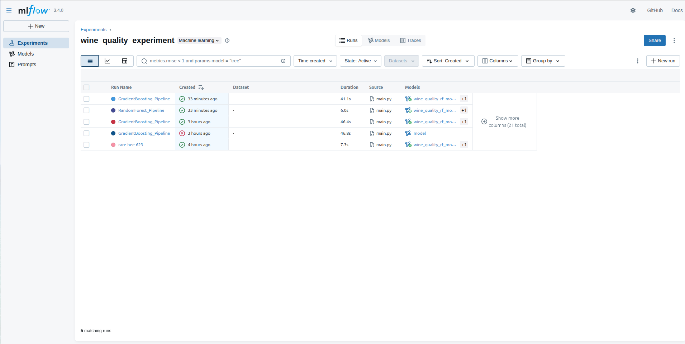

*The MLflow experiments view displays all training runs with their associated metrics. Each row represents a single training execution, showing the run name, duration, and key performance indicators. The interface supports sorting and filtering to identify top-performing configurations quickly.*

### Run Analysis

Individual run pages provide detailed breakdowns of training executions. The parameters section shows exactly which hyperparameter values produced the results. The metrics section displays all captured performance measurements. The artifacts section provides download links for models and associated files.

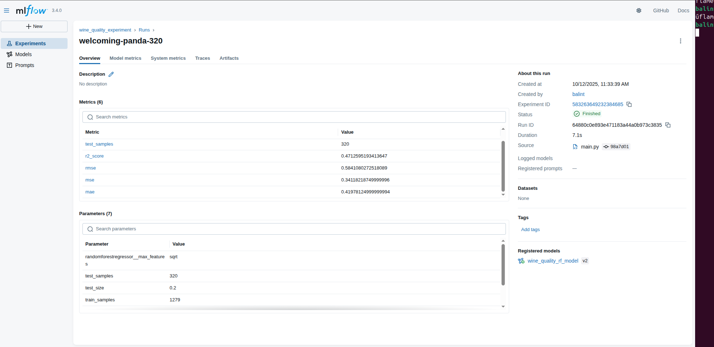

*Detailed run view showing comprehensive information about a single training execution. The metrics panel displays R-squared (0.4713), RMSE (0.5841), MSE (0.3411), and MAE (0.4198). The parameters panel shows the exact configuration used, while the artifacts section lists all generated files including the trained model.*

### Model Comparison

MLflow's comparison features enable systematic model selection. Side-by-side metric comparisons reveal which configurations achieve better performance. Parameter comparisons identify which settings drive improvements. Visualization tools create charts showing metric distributions across runs.

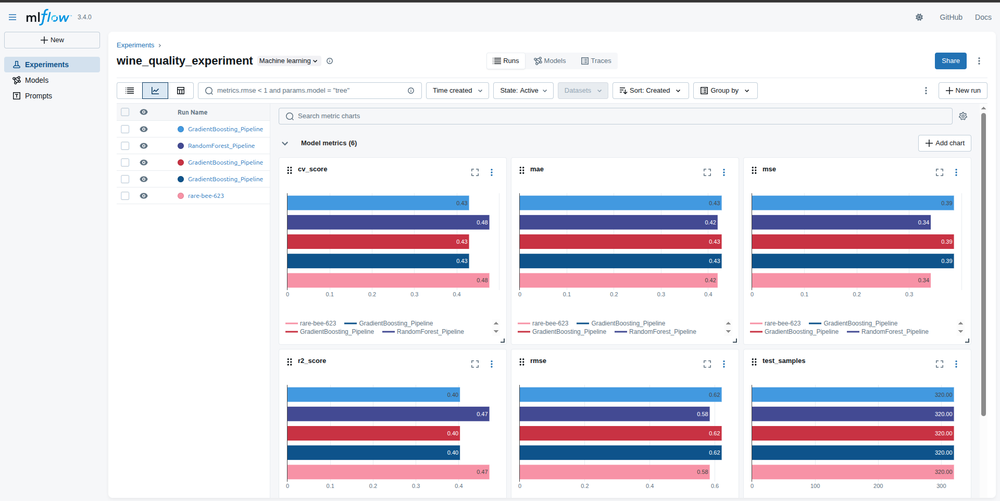

*Bar chart visualization comparing key metrics across multiple experiment runs. The chart displays cv_score, mae, mse, r2_score, and rmse for each selected run, enabling visual identification of the best-performing configurations.*

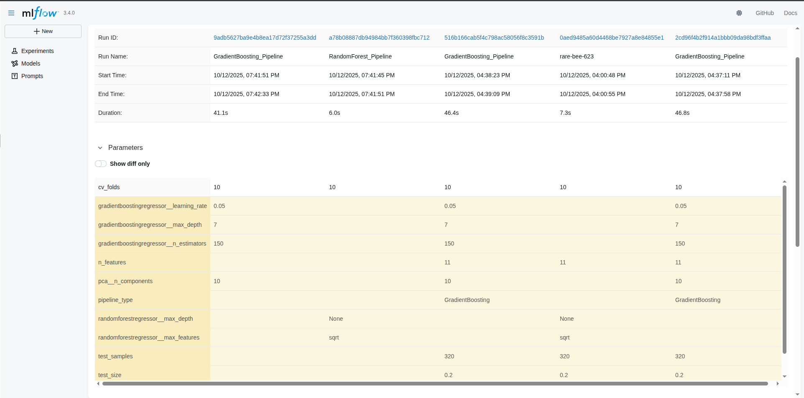

*Tabular comparison view showing detailed parameters for multiple runs. The table includes Run ID, pipeline type, execution timestamps, duration, and hyperparameters such as cv_folds, learning_rate, max_depth, and n_estimators.*

### Model Registry

The model registry manages the lifecycle of production models. After identifying a promising model through experimentation, data scientists register it in the registry with a meaningful name and version number. The registry tracks which model version currently serves production traffic and maintains history of all previous versions.

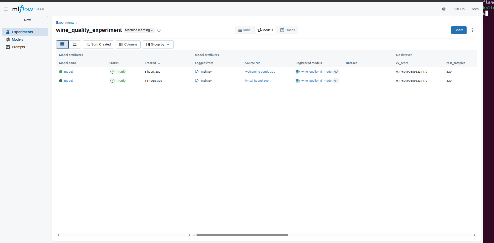

*The MLflow Models interface showing the wine_quality_rf_model with its version history. Each version links to its source training run, preserving complete traceability from production predictions back to the exact experiment that created the model.*

---

## Apache Airflow Orchestration

### DAG Design Principles

Airflow DAGs decompose complex workflows into discrete, testable tasks. Each task performs a single well-defined operation: load data, preprocess features, train model, evaluate performance, or register artifacts. Dependencies between tasks ensure correct execution order while allowing maximum parallelism for independent operations.

The platform implements several DAG patterns for different scenarios. Scheduled DAGs run at fixed intervals for routine retraining. Sensor-triggered DAGs activate when new data files appear. Webhook-triggered DAGs respond to external system events.

### Available Workflows

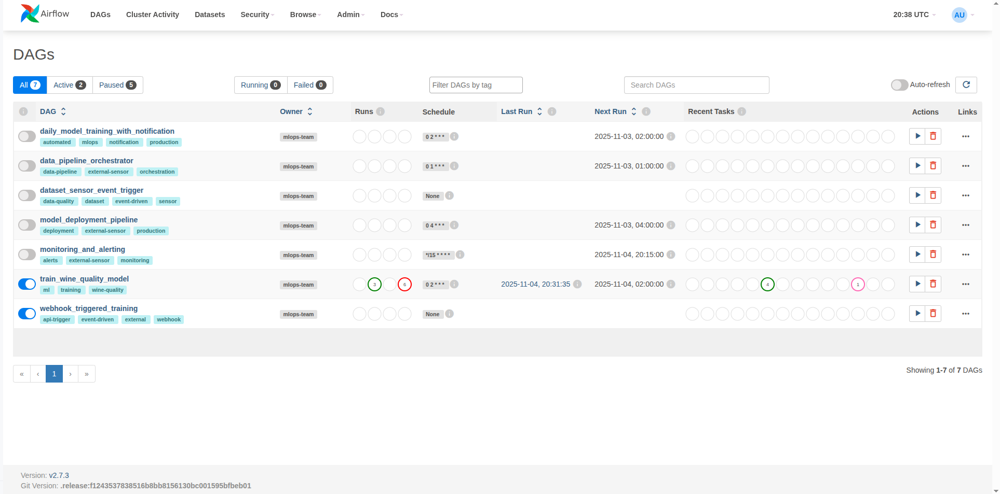

*The Airflow DAGs list showing seven configured workflows. Tags indicate each DAG's purpose: automated training, data pipeline orchestration, event-triggered processing, model deployment, monitoring, and webhook integration. The interface shows scheduling status and recent run outcomes for each DAG.*

**Daily Model Training DAG**: Executes every night at 2:00 AM, fetching the latest data and training fresh models. The pipeline compares new models against the current production version, automatically promoting improvements that exceed performance thresholds. This ensures the production model continuously improves as more data becomes available.

**Dataset Sensor DAG**: Monitors a designated directory for new data files. When a file appears, the sensor triggers a validation and training pipeline. This pattern supports scenarios where upstream systems deposit data at irregular intervals, ensuring immediate processing without manual intervention.

**Model Deployment DAG**: Handles the staged rollout of new models. After training DAGs register candidate models, the deployment DAG runs validation checks, deploys to a staging environment for testing, and finally promotes to production if all checks pass. This multi-stage approach catches issues before they affect users.

**Webhook Training DAG**: Responds to external HTTP triggers, enabling integration with CI/CD systems and data platforms. The webhook accepts parameters specifying which model to train and whether to force retraining regardless of performance comparisons.

### Task Dependencies

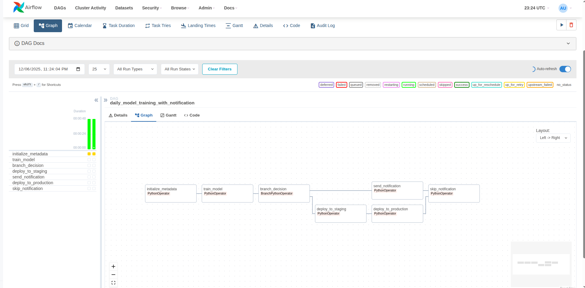

*Visual representation of the daily_model_training_with_notification DAG structure. The graph shows task flow from initialize_metadata through train_model to branch_decision. The branch splits based on model performance: exceeding thresholds proceeds to deploy_to_staging, then deploy_to_production, and finally send_notification. Models failing to exceed thresholds follow the skip_notification path.*

The branching structure implements conditional logic within workflows. After training completes, the branch_decision task evaluates whether the new model improves upon the current production baseline. Superior models proceed through deployment stages while inferior models skip deployment but still log their results for future reference. This prevents deploying models that would degrade service quality.

### Execution Monitoring

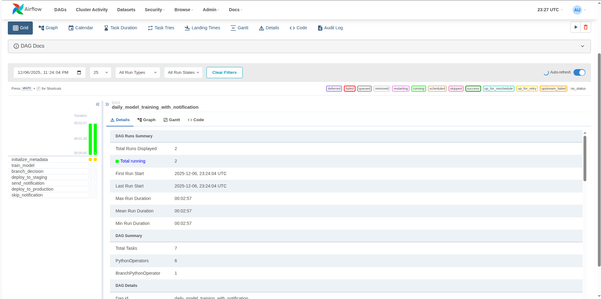

*DAG run summary displaying execution statistics. The view shows total runs, success and failure counts, first and last run timestamps, and duration distributions (maximum, mean, minimum). The DAG summary lists all tasks with their operator types.*

Airflow provides comprehensive execution visibility. The Grid view shows historical runs with color-coded success and failure indicators. The Graph view displays task dependencies with real-time status updates during execution. The Gantt view reveals task duration distributions and identifies bottlenecks.

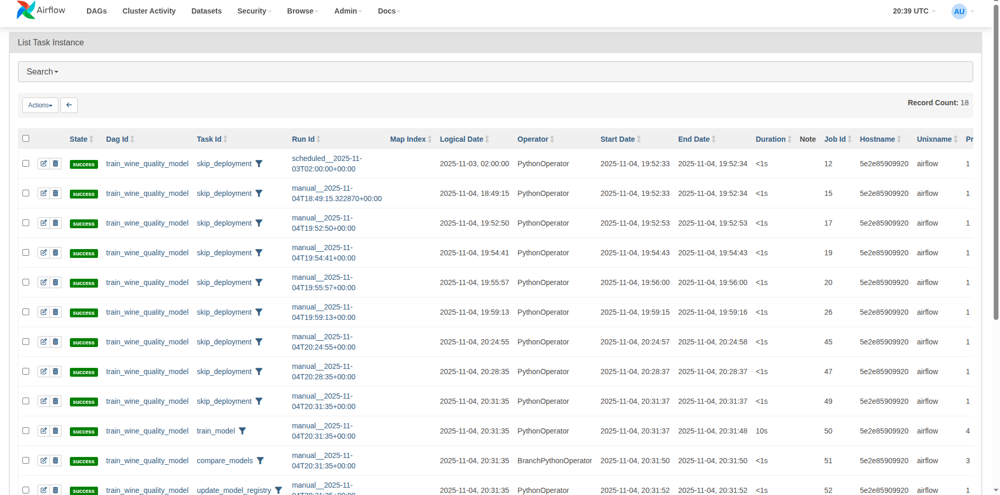

*Task instance list showing individual task executions. Each row displays the task state (success/failed), DAG ID, Task ID, Run ID, execution timestamps, operator type, and duration. This granular view enables debugging specific task failures by examining logs and retry history.*

### Historical Analysis

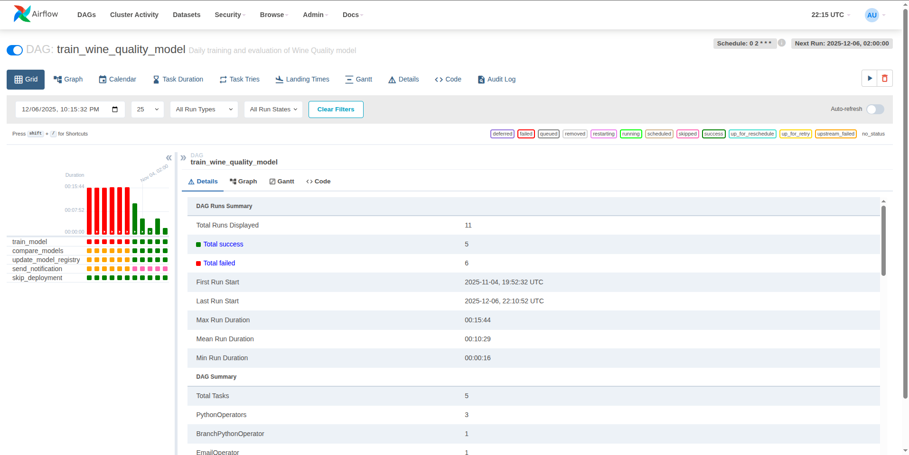

*Statistical analysis of the train_wine_quality_model DAG showing 11 total runs with 5 successes and 6 failures. The duration histogram visualizes execution time distribution. The task execution matrix shows success and failure patterns across individual tasks.*

Historical statistics help identify reliability issues. If a particular task fails frequently, it may indicate data quality problems, resource constraints, or code bugs. Duration trends reveal whether pipelines are slowing down over time, potentially due to growing data volumes or degrading infrastructure.

DAG definitions are located in `airflow/dags/`, with the primary training workflow in `train_wine_quality_dag.py`.

---

## REST API Services

### API Design

The prediction API follows REST conventions with OpenAPI documentation. Endpoints accept JSON payloads containing wine feature measurements and return quality predictions. The API validates inputs against expected schemas, returning informative error messages for malformed requests.

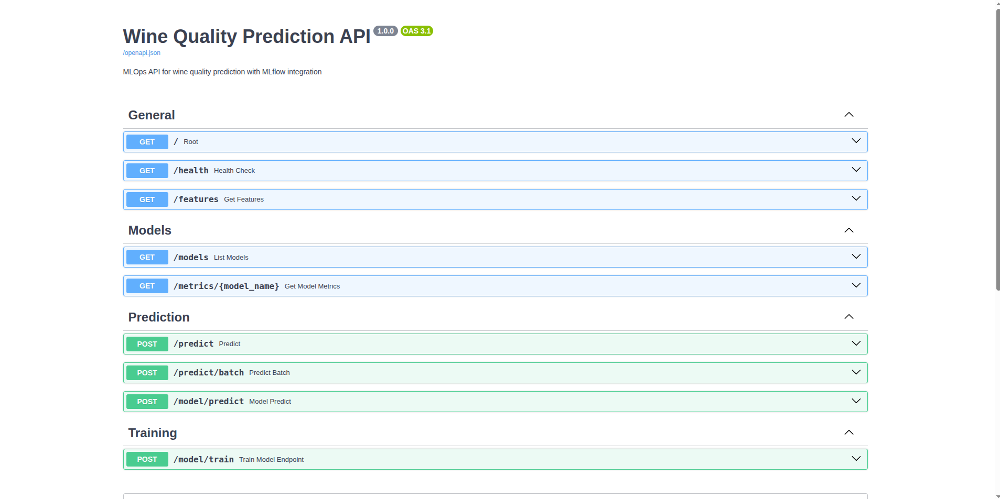

*FastAPI Swagger UI showing the Wine Quality Prediction API v1.0.0. Endpoints are organized into logical groups: General (root, health, features), Models (list available models, get metrics), Prediction (single and batch predictions), and Training (trigger model training). The interactive documentation allows testing endpoints directly in the browser.*

### Endpoint Structure

The API provides several endpoint categories serving different purposes:

**Health Endpoints**: Enable load balancers and container orchestrators to verify service availability. The health check returns service status and can include detailed diagnostics for troubleshooting.

**Feature Endpoints**: Return the expected input schema, helping client applications construct valid requests. This self-documenting approach reduces integration errors.

**Model Endpoints**: Expose information about available models and their performance characteristics. Clients can query which models exist, their training dates, and evaluation metrics.

**Prediction Endpoints**: Accept feature values and return quality estimates. The single prediction endpoint handles individual wine samples, while the batch endpoint processes multiple samples efficiently in a single request.

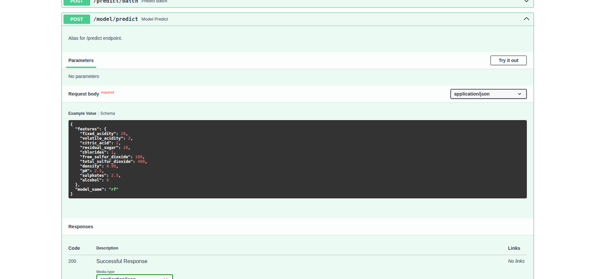

*The POST /model/predict endpoint documentation showing the request body schema. Required fields include fixed_acidity, volatile_acidity, citric_acid, residual_sugar, chlorides, free_sulfur_dioxide, total_sulfur_dioxide, density, pH, sulphates, and alcohol. The optional model_name parameter allows selecting specific model versions.*

### Request Processing

When a prediction request arrives, the API performs several validation and processing steps. Input validation ensures all required features are present with valid numeric values, rejecting malformed requests with descriptive error messages. Feature preprocessing applies the same StandardScaler transformations used during training, ensuring consistent input distributions. Model inference generates the quality prediction. Response formatting packages the result with metadata including the model version used and processing timestamp.

The API logs all requests for monitoring and debugging purposes. Logs capture input features, predictions, latency, and any errors encountered. This audit trail supports investigating prediction quality issues and understanding usage patterns.

API implementation details are in `airflow/api/fastapi_app.py` for the primary service and `airflow/api/flask_app.py` for the alternative Flask implementation.

---

## Monitoring Dashboard

### Monitoring Objectives

Effective ML monitoring goes beyond traditional application metrics. While request latency and error rates matter, ML systems also require tracking prediction quality, data distributions, and model behavior over time. The monitoring dashboard addresses all these concerns through integrated visualizations that help teams detect issues before they impact users.

### System Overview

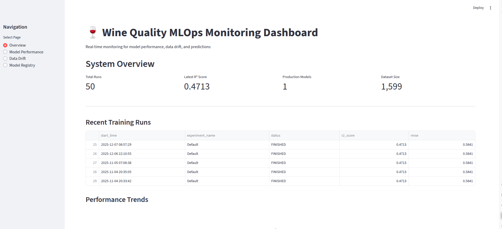

*The Wine Quality MLOps Monitoring Dashboard overview page. System Overview metrics display Total Runs (50), Latest R-squared Score (0.4713), Production Models (1), and Dataset Size (1,599). The Recent Training Runs table shows timestamps, experiment names, status, r2_score, and rmse for recent executions.*

The overview provides at-a-glance system health assessment. Key metrics summarize overall activity levels and current model performance. The training runs table enables quick identification of recent successes and failures. Dashboard users can immediately spot anomalies like sudden performance drops or unusual run patterns that warrant investigation.

### Performance Analysis

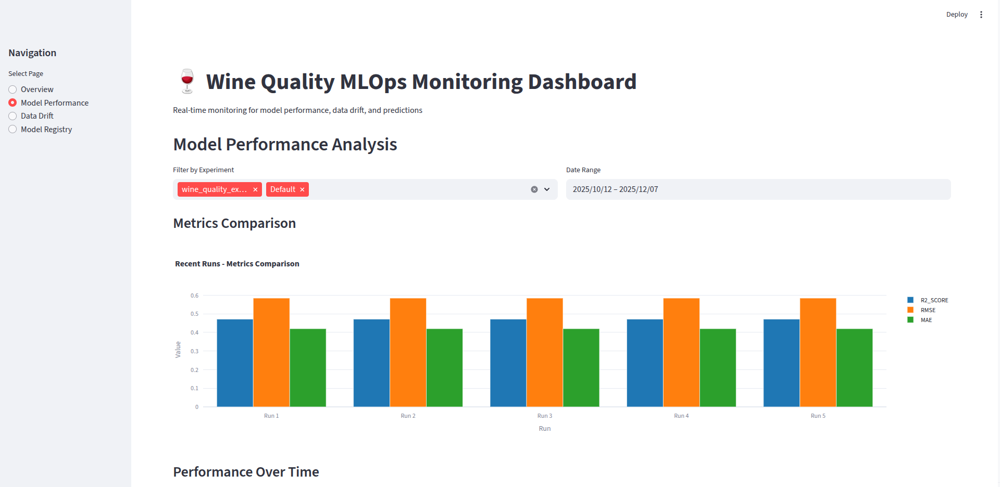

*Model Performance Analysis page featuring experiment filters and date range selectors. The Metrics Comparison bar chart visualizes R2_SCORE, RMSE, and MAE across recent runs. Color-coded bars enable quick comparison between training runs.*

Performance trends reveal whether models improve over time as more data becomes available and training processes mature. Plateauing metrics might indicate the need for new features or different model architectures. Degrading metrics signal potential data quality issues or concept drift that requires investigation.

### Data Drift Detection

Data drift occurs when production data distributions diverge from training data distributions. Models trained on historical data may perform poorly on shifted distributions, making drift detection critical for maintaining prediction quality. The platform integrates Evidently AI for statistical drift detection.

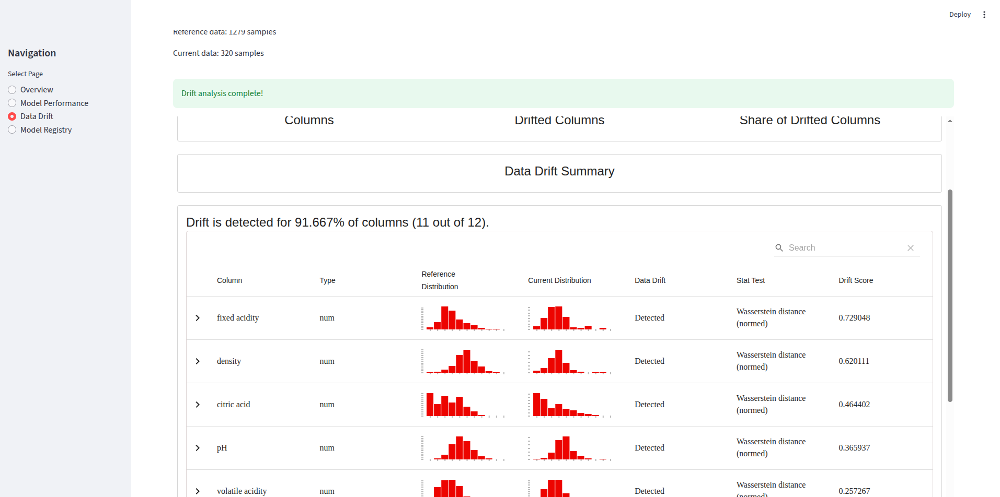

*Evidently AI data drift analysis showing drift detected in 91.667% of columns (11 out of 12). The table displays each feature with reference and current distributions visualized as histograms, drift detection status, and Wasserstein distance scores ranging from 0.26 to 0.73.*

The drift analysis compares production data distributions against training data baselines using statistical tests. Significant drift triggers alerts, prompting investigation and potential model retraining. The Wasserstein distance metric quantifies how much distributions have shifted, helping prioritize which features require attention.

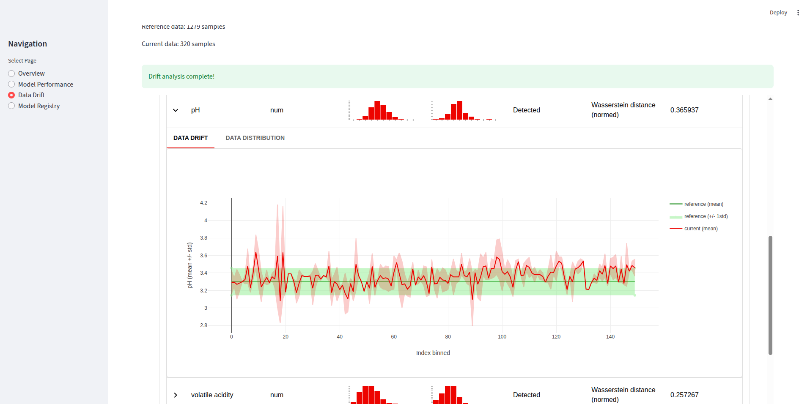

*Detailed drift analysis for the pH feature. The visualization shows reference data (1,279 samples) compared to current data (320 samples). The time series chart displays reference mean with standard deviation bounds (green band) against current mean values (red line), clearly showing distribution shift over time.*

Detailed drift views help diagnose root causes. The pH feature analysis shows current measurements trending higher than the reference distribution. This might indicate seasonal variations in wine production, changes in grape sourcing, measurement equipment calibration issues, or shifts in the types of wines being submitted for prediction.

### Model Registry View

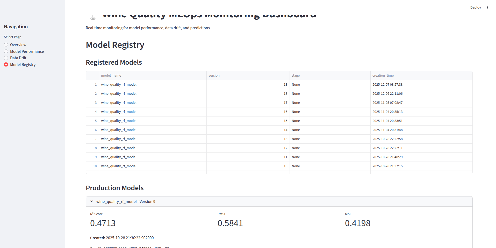

*Model Registry page showing the Registered Models table with wine_quality_rf_model versions 10 through 19, creation timestamps, and stage assignments. The Production Models section displays wine_quality_rf_model Version 9 with its performance metrics: R-squared 0.4713, RMSE 0.5841, MAE 0.4198.*

The registry view provides operational visibility into deployed models. Teams can see which version currently serves production traffic, review the performance characteristics that justified its deployment, and access the complete version history for rollback if needed. This transparency is essential for debugging production issues and maintaining audit trails.

The monitoring dashboard source code is located in `monitoring/streamlit_app.py`.

---

## CI/CD Pipeline

### Pipeline Philosophy

The CI/CD pipeline treats ML code with the same rigor as traditional software. Every commit triggers automated testing, code quality checks, and security scans. Successful builds produce deployable artifacts. The pipeline catches problems early when they are cheaper to fix and ensures production deployments meet quality standards.

This approach prevents the common anti-pattern of "works on my machine" deployments. By building and testing in clean, reproducible environments, the pipeline ensures that deployed code behaves identically to what developers tested locally.

### Pipeline Structure

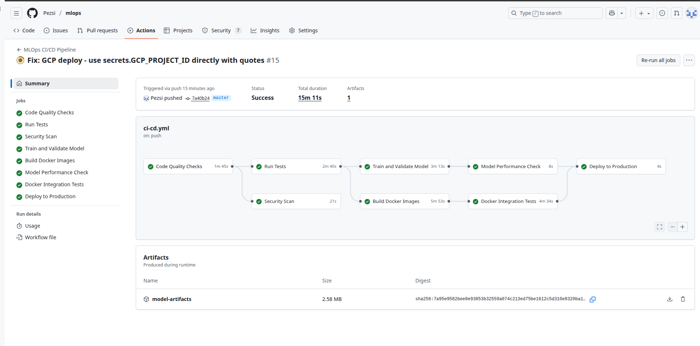

*GitHub Actions MLOps CI/CD Pipeline workflow visualization. Eight jobs execute in sequence and parallel: Code Quality Checks (1m 45s), Run Tests (2m 40s), Security Scan (21s), Train and Validate Model (3m 13s), Build Docker Images (5m 53s), Model Performance Check (8s), Docker Integration Tests (4m 34s), and Deploy to Production (4s). All jobs completed successfully with total duration of 15m 11s.*

The pipeline orchestrates multiple validation stages. Early stages focus on code quality and fast-running tests, providing quick feedback on obvious problems. Middle stages perform more comprehensive validation including model training and container building. Final stages run integration tests against the complete system and deploy to production.

### Code Quality Verification

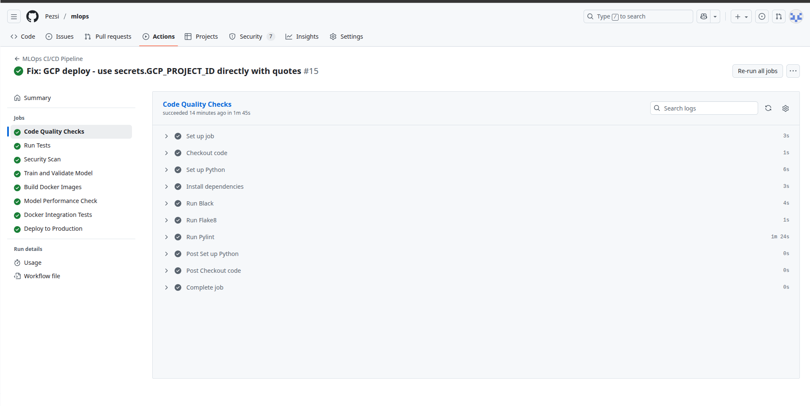

*Code Quality Checks job details showing individual steps: Set up job, Checkout code, Set up Python, Install dependencies, Run Black (4s), Run Flake8 (1s), Run Pylint (1m 24s). All steps completed successfully.*

Code quality checks enforce consistent style and catch common errors. Black automatically formats code to eliminate style debates and ensure uniform appearance. Flake8 identifies syntax errors, undefined variables, and unused imports that would cause runtime failures. Pylint performs deeper static analysis, flagging potential bugs, suggesting improvements, and enforcing coding standards.

### Automated Testing

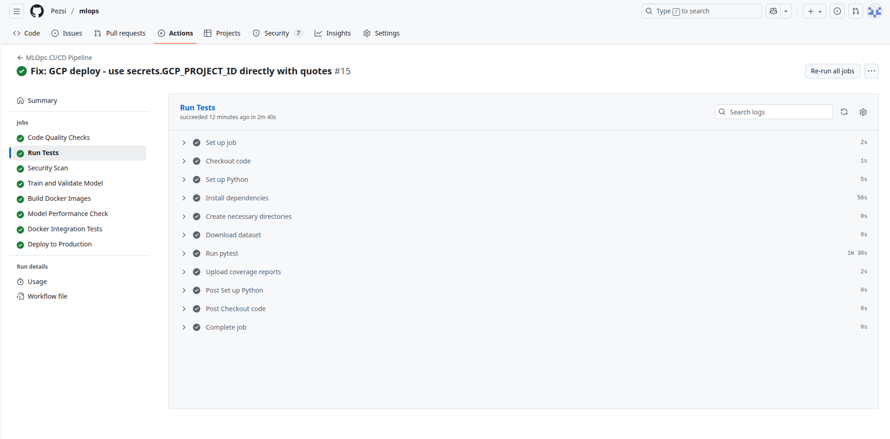

*Run Tests job showing pytest execution. Steps include environment setup, dependency installation (56s), directory creation, dataset download, and test execution (1m 30s). The job uploads coverage reports for analysis.*

The test suite validates individual components and end-to-end workflows. Unit tests verify that preprocessing functions handle edge cases correctly, including missing values, extreme outliers, and unexpected data types. Integration tests confirm that training pipelines produce valid models with expected performance characteristics. API tests ensure endpoints respond correctly to various request patterns including malformed inputs.

Test definitions are organized in the `tests/` directory, with separate modules for data loading, preprocessing, training, evaluation, and API testing.

### Security Scanning

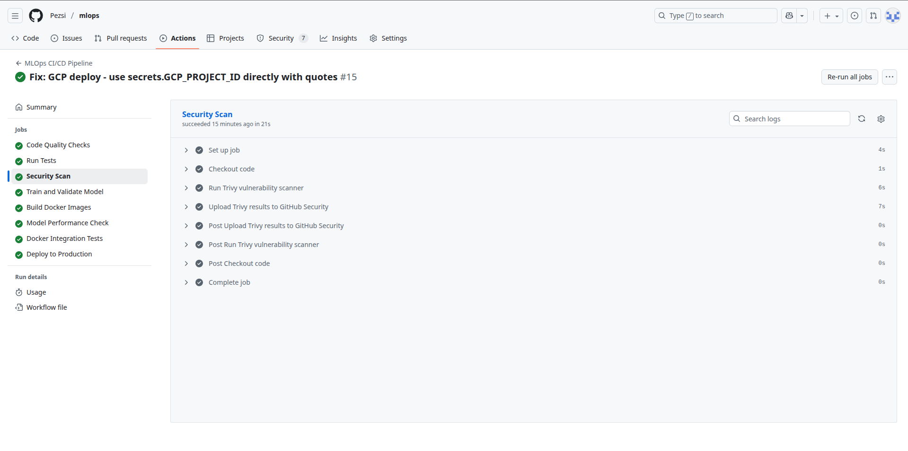

*Security Scan job using Trivy vulnerability scanner. Steps include code checkout, vulnerability scanning (6s), and uploading results to GitHub Security (7s). The scan completed with no vulnerabilities detected.*

Security scanning identifies vulnerabilities in dependencies and container images before they reach production. Trivy scans Python packages against vulnerability databases, flagging known security issues with severity ratings. The pipeline fails if critical vulnerabilities are detected, preventing deployment of compromised code.

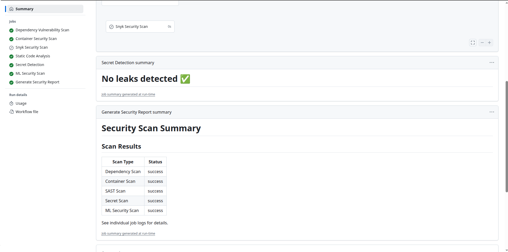

*Security Scan Summary showing comprehensive results. All scans passed: Dependency Vulnerability Scan, Container Security Scan, Snyk Security Scan, Static Code Analysis, Secret Detection (no leaks detected), and ML Security Scan.*

The security summary aggregates results from multiple scanning tools. Dependency vulnerability scans check Python packages. Container security scans examine Docker base images. Static code analysis identifies potential security issues in application code. Secret detection prevents accidental credential commits. ML-specific scans check for vulnerabilities unique to machine learning systems.

### Model Training Validation

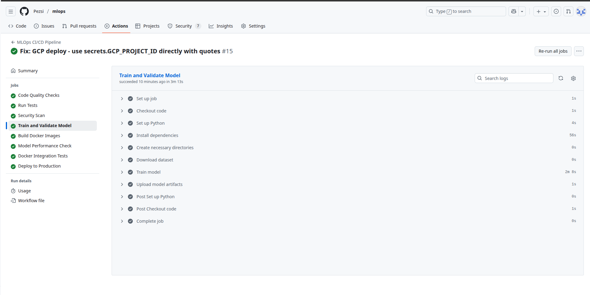

*Train and Validate Model job steps: environment setup, dependency installation (56s), directory creation, dataset download, model training (2m 8s), and artifact upload. The job validates that trained models meet performance thresholds.*

The pipeline trains models from scratch to verify that training code produces valid results with current dependencies and configurations. This catches issues like broken preprocessing code, incompatible library versions, or degraded model performance before they reach production. Trained models are uploaded as artifacts for downstream deployment stages.

### Integration Testing

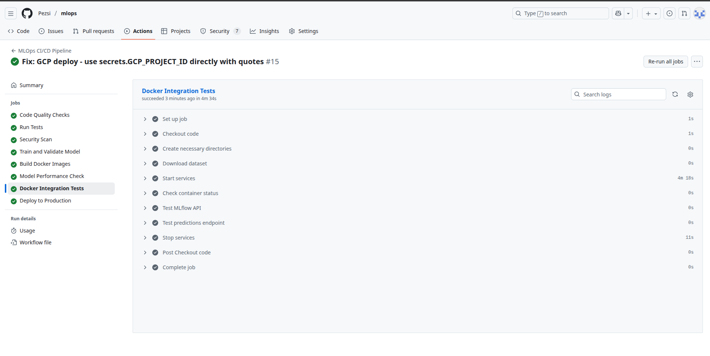

*Docker Integration Tests job executing end-to-end validation. Steps include starting services (4m 18s), checking container status, testing MLflow API connectivity, testing prediction endpoints, and stopping services (11s).*

Integration tests deploy the complete application stack in Docker containers and exercise real workflows. The tests verify that services start correctly, communicate with each other properly, and handle requests as expected. This catches integration issues that unit tests might miss, such as network configuration problems, volume mounting errors, or service discovery failures.

The CI/CD workflow definition is in `.github/workflows/mlops-ci-cd.yml`.

---

## Cloud Deployment

### Deployment Strategy

The platform deploys to Google Cloud Platform using Cloud Run, a serverless container platform. Cloud Run automatically scales container instances based on request volume, scaling to zero during idle periods to minimize costs. This approach suits ML inference workloads with variable traffic patterns, where usage might spike during business hours and drop to nothing overnight.

### Container Registry

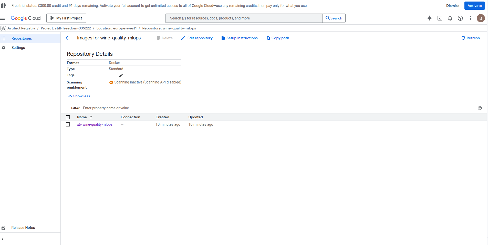

*Google Cloud Artifact Registry showing the wine-quality-mlops repository in europe-west1 region. The repository stores Docker images built by the CI/CD pipeline, with version tags enabling rollback to previous releases if issues emerge.*

Artifact Registry stores container images built by the CI/CD pipeline. Each successful build pushes a new image with version tags derived from git commits. The registry maintains image history indefinitely, enabling rollback to any previous version if issues emerge after deployment. This versioned approach ensures production can always return to a known-good state.

### Cloud Run Service

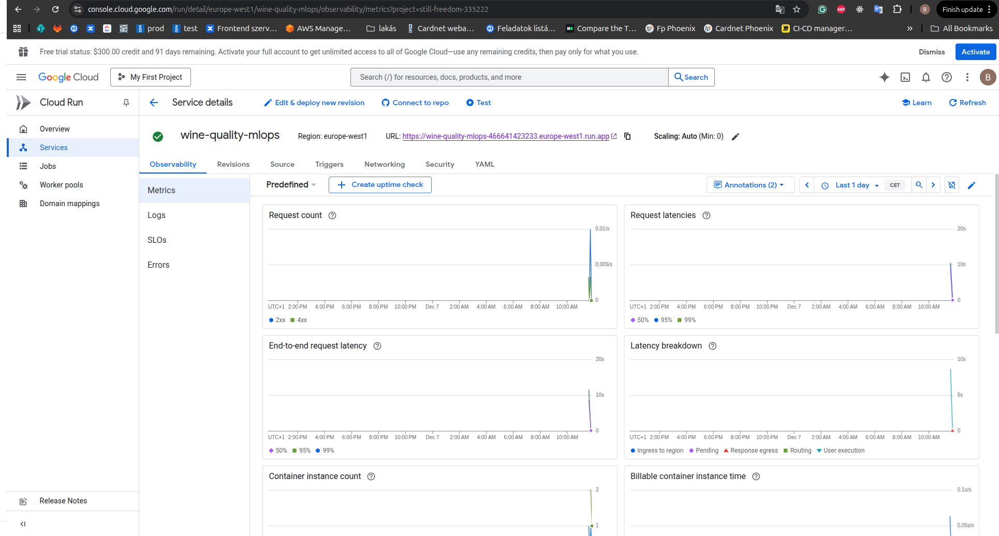

*Google Cloud Run service details for wine-quality-mlops. The service runs in europe-west1 with automatic scaling from 0 to configured maximum instances. Observability metrics display request count, latency percentiles (50%, 95%, 99%), and container instance count.*

Cloud Run manages the operational complexity of running containerized services. The platform handles load balancing across instances, SSL termination for secure connections, automatic scaling based on traffic, and health monitoring with automatic restarts. Developers focus on application logic while GCP manages infrastructure concerns.

The service URL provides a stable HTTPS endpoint for prediction requests. Cloud Run routes traffic to healthy container instances, automatically spinning up new instances during traffic spikes and terminating idle instances to reduce costs. This elasticity means paying only for actual usage rather than provisioned capacity.

### Production API

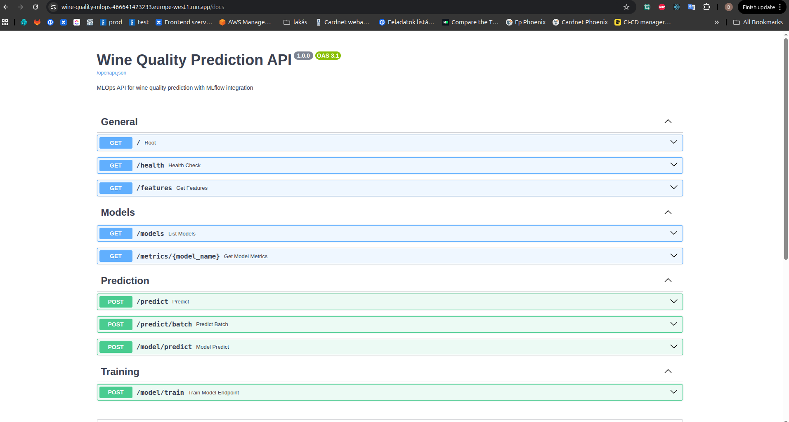

*Production API running on Cloud Run accessible at the wine-quality-mlops endpoint. The Swagger UI displays identical endpoints to local development, confirming successful deployment of the complete API surface.*

The production API mirrors the local development experience. The same Swagger documentation, endpoints, and request formats work identically in both environments. This consistency simplifies client integration and reduces deployment-related surprises. Developers can test against local services with confidence that production will behave the same way.

Detailed deployment instructions, including GCP setup scripts, configuration options, cost management, and troubleshooting guides, are documented in `GCP_DEPLOYMENT_GUIDE.md`.

---

## Security

### Security Approach

ML systems present unique security challenges beyond traditional applications. Training data might contain sensitive information that models could memorize and leak. Model weights can encode private details about training data through membership inference attacks. Prediction APIs could be exploited to reverse-engineer model behavior or inject adversarial inputs designed to cause misclassification.

The platform addresses these concerns through multiple security layers. Infrastructure security follows cloud provider best practices with IAM roles, network isolation, and encrypted storage. Application security implements input validation, authentication, and rate limiting. ML-specific security includes model integrity verification, data poisoning detection, and adversarial robustness testing.

### Automated Security Scanning

The CI/CD pipeline runs comprehensive security scans on every commit. Dependency scanning identifies vulnerable packages in requirements files. Container scanning checks base images for known issues. Static analysis detects potential code vulnerabilities like SQL injection or command injection. Secret detection prevents accidental credential commits that could expose API keys or database passwords.

Security scan results integrate with GitHub Security, providing a centralized view of vulnerability status across the repository. Critical findings block deployments until resolved. Lower severity findings generate alerts for prioritized remediation during regular maintenance cycles.

### API Security

The webhook API requires API key authentication, preventing unauthorized access to pipeline triggers. Keys rotate periodically and revoke immediately upon suspected compromise. Rate limiting prevents abuse and ensures fair resource allocation across clients. Input validation rejects malformed requests before they reach application logic.

Detailed security implementation, including ML-specific protections like data poisoning detection, adversarial robustness testing, model integrity verification, and external model validation, is documented in `MLSECOPS_README.md`.

---

## Getting Started

### Prerequisites

Running the platform locally requires Python 3.8 or higher, Docker with Docker Compose, and Git. Cloud deployment additionally requires a Google Cloud Platform account with billing enabled. Familiarity with command line operations and basic Docker concepts will help with troubleshooting.

### Local Development

Clone the repository and navigate to the project directory. Create a Python virtual environment to isolate dependencies from system packages. Activate the virtual environment, then install dependencies from requirements.txt using pip.

Train initial models by running the main pipeline script with the compare flag. This creates baseline Random Forest and Gradient Boosting models, populates the MLflow experiment database with training runs, and registers the best model in the model registry. The training process takes a few minutes and produces console output showing progress.

Start Docker services using Docker Compose with the detached flag. This launches all platform components in the background, including Airflow webserver and scheduler, MLflow tracking server, prediction API, and monitoring dashboard. The first startup takes longer as Docker downloads base images and builds containers.

### Service Access

After starting services, access the Airflow UI at localhost:8081 with credentials admin/admin. The Airflow interface shows DAG status, allows manual triggering, and provides access to task logs. The MLflow UI at localhost:5000 requires no authentication and displays experiment runs, model registry, and comparison tools. The FastAPI documentation at localhost:8000/docs provides interactive API testing with request/response examples. The Streamlit dashboard at localhost:8501 displays monitoring visualizations and drift analysis.

### Verification

Verify the installation by running the test suite with pytest. Tests validate all pipeline components from data loading through model serving. Successful tests confirm that the local environment is correctly configured. Coverage reports identify which code paths the tests exercise.

---

## Project Structure

The repository organizes code by functional area:

**Root Directory**: Contains configuration files (config.py, docker-compose.yml, requirements.txt), Docker definitions, and documentation files. The main.py script provides the command-line interface for training models.

**airflow/**: Holds DAG definitions in dags/ subdirectory and API implementations in api/. The utils/ subdirectory contains shared helper functions used across DAGs.

**monitoring/**: Contains the Streamlit dashboard application (streamlit_app.py) and supporting visualization code.

**security/**: Implements ML-specific security features including poisoning detection, robustness testing, and external model validation.

**tests/**: Organizes test modules by component, with separate files for data loading, preprocessing, training, evaluation, and API testing.

**gcp/**: Contains deployment scripts and configuration for Google Cloud Platform, including setup, deploy, and monitoring utilities.

---

## Additional Documentation

The following specialized documentation provides detailed information for specific topics:

**DEVELOPMENT_GUIDE.md**: Complete guide for setting up development environments, running the platform locally without Docker, Docker deployment procedures, testing practices, and code quality tools. Essential reading for developers working with the codebase.

**AIRFLOW_GUIDE.md**: Comprehensive Apache Airflow documentation covering DAG architecture, available workflows (daily training, dataset sensors, webhook triggers), task design patterns, trigger mechanisms, and operational procedures for monitoring and debugging workflows.

**API_GUIDE.md**: Technical documentation for the REST API services including the FastAPI prediction service, Flask alternative implementation, and webhook trigger API. Covers authentication, error handling, performance considerations, and integration patterns.

**MLSECOPS_README.md**: ML security documentation covering data poisoning detection, model poisoning detection, adversarial robustness testing, dependency security scanning, and external model validation. Includes OWASP ML Security Top 10 alignment and real-world attack scenario explanations.

**GCP_DEPLOYMENT_GUIDE.md**: Detailed Google Cloud Platform deployment instructions including Cloud Run architecture, deployment processes, configuration and scaling, monitoring and operations, cost management, security considerations, and advanced topics like traffic splitting and VPC integration.

**gcp/QUICK_START.md**: Streamlined deployment guide for quickly getting the platform running on GCP Cloud Run. Covers the essential steps without extensive explanations, suitable for experienced users.

---

## Version Information

- Version: 2.0.0
- Last Updated: December 2025
- Status: Production Ready
